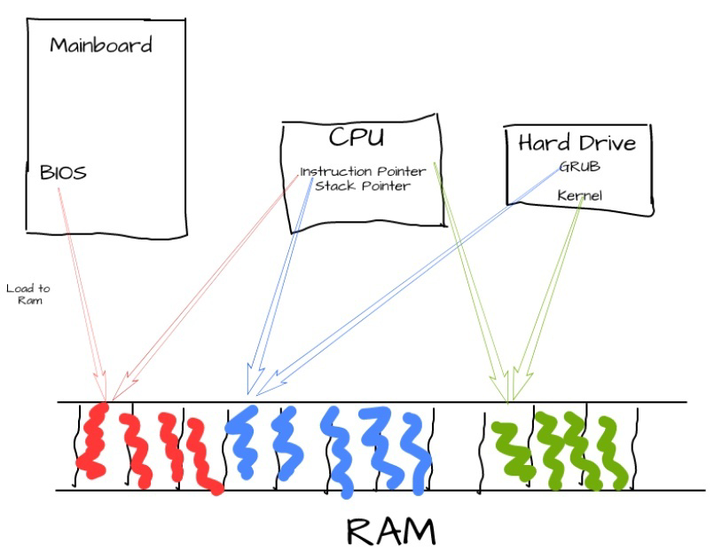
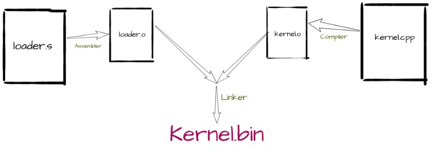
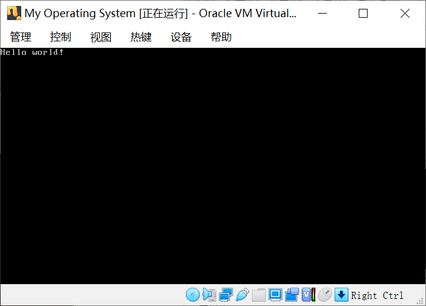

写的有点乱，将就一下。。。
### 整体思路

#### linux系统启动顺序
加载BIOS，计算机启动时会首先加载BIOS信息，再读取Master Boot Record(主引导记录)，系统会将BIOS指定的硬盘的MBP复制到物理内存中，被复制的内容就是Boot Loader,这里具体就是grub，可以在我们的mykernel.iso中就是grup。

主板上有一个特殊的程序，叫BIOS. 最开始的时候，计算机会把BIOS程序加载到内存里。然后指令指针（Instruction Pointer）会指向这段简短的BIOS程序。BIOS程序读取硬盘，从里面加载boot loader到内存，并设置指令指针到内存。接着，bootloader执行并且读取硬盘，从里面读取操作系统内核到内存。

因为boot loader并不能设置堆栈指针，所以如果你想用c++写操作系统，你就需要一段汇编程序帮助你设置堆栈指针，来call用c++写的main函数。因此，OS的kernel应该包含两个程序: 1.一个是用汇编写的loader.s， 来设置堆栈指针，并把操作系统加载到内存，2.用c++编写的操作系统kernel.cpp.

#### kernel.cpp
kernel的开始点是一个kernelMain函数，我们通过extern "C"的方式来让编译器不要改变函数名字(C++这种高级语言会改变函数名字的)，这样我么就可以在汇编程序里，用相同的名字方便的调用这个函数了。
在我们的操作系统里，我们依旧不能使用c++的函数库，所以我们没法使用printf函数。所以我们需要自己实现打印函数。打印函数的逻辑其实就是让显示器自动打印任何位于内存0xb8000位置上的东西。所以我们只需要把字符串放到这个内存地址就好了。

#### loader.s
设置堆栈指针来调用kernelMain函数

#### linker.ld
linker会把loader和kernel连接在一起，成为一个可执行文件。

#### makefile

# 问题
make loader.o时报错：clang: error: unsupported option '--32'
	网上并没有关于"--32"的，但是有类似的，主要原因是应该用gcc make，但是我的电脑gcc实际是clang在make，修改成gcc make通过。

**在后续的实验中我转移到了ubuntu14中**

make mykernel.iso时报错：grub-mkrescue:command not found
	主要原因是在~~centos~~下进行的需要ubuntu的一些依赖，所以后面在**ubuntu**系统下，ubuntu系统需要安装**xorriso**。

最后成功制作了mykernel.iso，并且在virualbox中运行；

