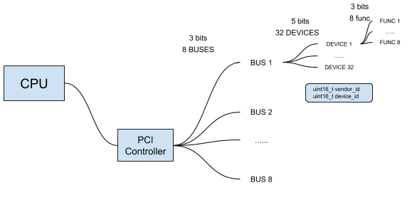

### [PCI](https://zh.wikipedia.org/wiki/%E5%A4%96%E8%AE%BE%E7%BB%84%E4%BB%B6%E4%BA%92%E8%BF%9E%E6%A0%87%E5%87%86)

CPU通过PCI Controller询问端口上有什么设备、中断是多少。然后只要设备写了特定的驱动或其他必要的就可以进行使用。我们的PCI大致采用的下面这种结构

并且为了每个存在的device创建一个PeripheralComponentInterconnectDeviceDescriptor表用来存储信息，包括设备号、销售商号等。PCI启动时就是搜索整个bus下面的device。

并且还有专门的PCI基址类，由于PC-AT兼容系统CPU只有内存和I/O两种空间，没有专用的配置空间，PCI协议规定利用特定的I/O空间操作驱动PCI桥路转换成配置空间的操作。目前存在两种转换机制，即配置机制1#和配置机制2#。配置机制2#在新的设计中将不再被采用，新的设计应使用配置机制1#来产生配置空间的物理操作。这种机制使用了两个特定的32位I/O空间，即CF8h和CFCh。这两个空间对应于PCI桥路的两个寄存器，当桥路看到CPU在局部总线对这两个I/O空间进行双字操作时，就将该I/O操作转变为PCI总线的配置操作。寄存器CF8h用于产生配置空间的地址（CONFIG-ADDRESS），寄存器CFCh用于保存配置空间的读写数据（CONFIG-DATA）。
