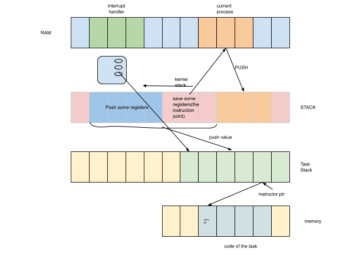

### [多任务](https://en.wikipedia.org/wiki/Computer_multitasking)

多任务实现主要是通过中断来更改执行不同的程序，大致原理类似于上图。计算机以交错的方式执行多个任务的分段，而任务共享诸如中央处理单元（CPU）和主存储器之类的公共处理资源。多任务自动中断正在运行的程序，保存其状态（部分结果，存储器内容和计算机寄存器内容），并加载另一个程序的保存状态并将控制权转移给它。