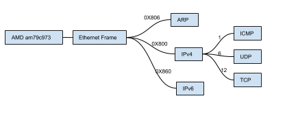

### [AMD am79c973网卡](http://www.lowlevel.eu/wiki/AMD_PCnet)

AMD网卡驱动其实就是实现网卡在物理层上进行发送和接收数据，需要很多的数据表来存储各项信息。InitializationBlock用来存放初始化信息，包括MAC地址、模式、传输数据的地址等。

主要就是对数据的传送和读取这两个操作，send操作主要是将数据写入到sendbuffers数组中，并包含了一些设置和判断。Receive操作就是找到正确地可读的recvbuffers数组并读取显示这些数据，这里有一点就是send和receive数组，这在初始化的时候已经定义好了数组的位置（在InitializationBlock中），那么在后面的网卡运行时，设备本身是会将数据写入的。还有一点就是数据接收，是在中断中进行，根据端口读取到的值，判断做出操作。

我们网络部分主要就是实现下面的部分(不包括ipv6)，包括物理层的设备驱动，链路层的ARP和以太网帧，网络层的ipv4和ICMP，传输层的TCP和UDP，和一点应用层的http。

