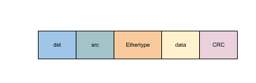

### [Ether Frame](https://en.wikipedia.org/wiki/Ethernet_frame)

以太网帧是数据链路层所收发的数据，是对物理层的数据进行处理后的数据，在这里我们就是增加了以太网帧数据头，包括dstMAC、srcMAC和type。以太网帧包含了目的MAC地址，因为MAC地址的唯一性，网卡设备会自动解析保存应该收到的数据。

以太网帧格式如下，但是我们跑掉了crc

