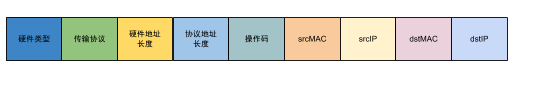

### [ARP](https://en.wikipedia.org/wiki/Address_Resolution_Protocol)

ARP报文格式如下

在ARP类中，主要就是实现IP地址到MAC地址的解析，而这个解析的过程实际上就是在自己的映射表中创建IP到MAC的映射，一个MAC地址对应一个IP。如果在当前表中没有IPMAC映射，那么我们就会进行地址广播，通过目标主机获取这个MAC地址，并更新自己的表。