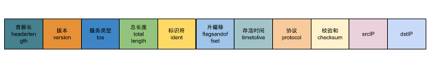

### [ipv4](https://en.wikipedia.org/wiki/IPv4)

ipv4的数据报格式如下

到这里，ipv4和前面一样主要是发送接收两个功能，发送的话就是报文结构明白后很容易发送，无非就是打包好报文，进行发送，但是ipv4因为有网关的存在需要对ip地址进行判断，再发送。

### [ICMP](https://en.wikipedia.org/wiki/Internet_Control_Message_Protocol)

ICMP的数据报格式很简单，我们所熟悉的ping就是ICMP实现，所以我们接收就是针对ping做回应。

### [UDP](https://en.wikipedia.org/wiki/User_Datagram_Protocol)

UDP是一种无连接的协议，所以就实现一下监听端口，发送数据。UDP的报文格式也很简单，就源地址、目的地址、长度和校验和。这里主要就是监听，监听就是监听我们自己的ip下特定端口，一开始也会以为有目标ip和端口，其实这样是不对。

