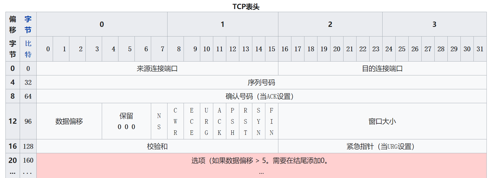

### [TCP](https://en.wikipedia.org/wiki/Transmission_Control_Protocol)

TCP报文格式如下

TCP作为面向连接的协议，最主要的就是三次握手和四次挥手。其实TCP三次握手和挥手理解起来没那么难，主要是在实现上，得明白整个流程，保证思路清晰。
三次握手：这个就是一个连接的过程，当你客户机想要和和某个服务器通信时，或者他找你通信，最开始我们需要建立一个连接(也就是socket)，先向服务器发送一个报文，报文主要是建立连接请求SYN，同时，我们本地socket是保存的，并记录了状态（这个状态用来接收ACK+SYN消息时回传确认，因为不能接收到消息就处理，需要根据当前状态确认），服务器收到消息时判断有没有这个连接（第一次都没有），创建socket，然后发送ACK+SYN，同时自身socket也会改变，最后本地接收到消息后，匹配自身状态并发送最终确认并开启连接，服务器收到消息也开启连接。
四次挥手：当客户机想取消连接或服务器，那么就发送一个FIN请求断开连接，并将自身状态变为FIN_WAIT1。当服务器收到断开请求时根据自身状态做出回应ACK+FIN，同时自身也变为CLOSE_WAIT。这时客户机收到断开的回应，自身状态变为CLOSED，断开连接，并发送最终ACK回应，服务器收到后断开。

下面维基百科给出的过程图.

如果觉得上图难理解的话，那么下面这个相对来说比较好理解

