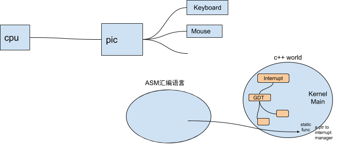

### [中断](https://zh.wikipedia.org/wiki/%E4%B8%AD%E6%96%B7)

有一说一，对中断理解起来还是比较容易的，但是实际从零开始去写一个中断还是比较难的。作者在中断实现思路上和我们所理解的是一样。中断向量表用来保存所有中断的信息，以便于特定中断触发时可以找到相应的相应的中断处理函数，在这里并没有写中断优先级，发生时抢占，所以讲道理当系统足够大的时候会有意想不到的结果。然后还有InterruptManager和InterruptHandler，一个中断的响应应该是通过InterruptHandler去找InterruptManager的响应函数响应，并判断响应是否可行。在后面的键盘和鼠标中都是使用中断方式，同时虚函数可以保证我们是正确的处理方式。

#### 一些中断的解释
中断是操作系统必不可少的一部分，中断信号由外部设备发起，准确来说是由外部设备的控制器发起，因为外部设备本身并不能发起信号。控制器就向IO PIC发送中断信号，IO PIC把信号传送给CPU，如果根据当时情况，要处理这个中断，就保存当时的运行上下文，切换到中断上下文中，根据IDT查找对应的处理函数进行处理。处理完成后，需要恢复中断之前的状态。

每个外部设备连接一条中断线，当设备需要中断CPU时，通过这些中断线，发送中断请求。中断控制器感知到这些中断请求，会设置中断控制器中的中断请求寄存器的相应位为1，鉴于多个中断可能并发到达，中断控制器具备中断判优功能，当其选定一个中断作为当前响应中断时，会清除中断请求寄存器中的对应位，然后设置中断服务寄存器的某些位为1，表明CPU正在服务于某个中断请求。